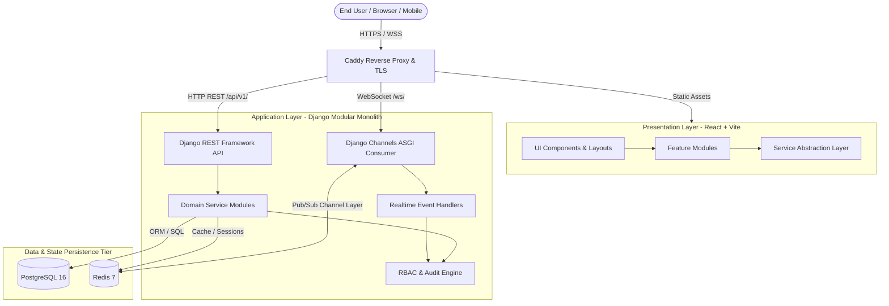
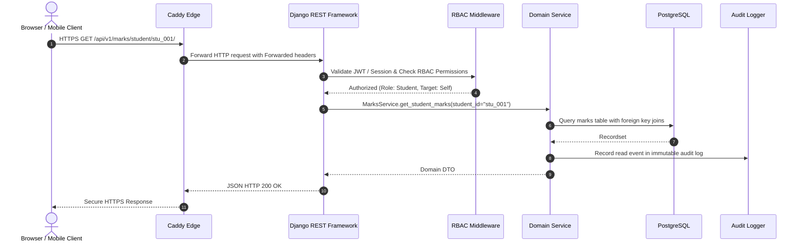
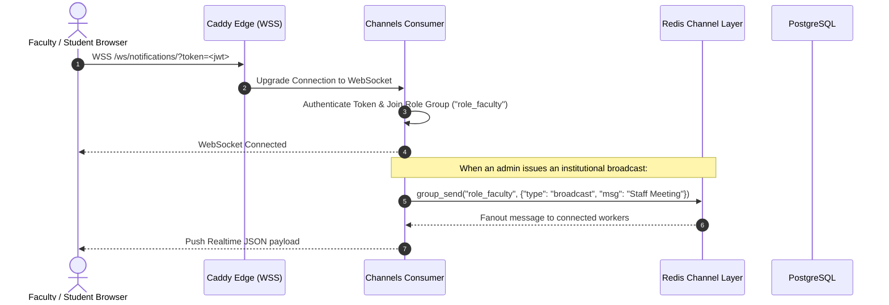

# System Architecture & Topology Specification

> **Status**: Authoritative Master Architecture  
> **Phase**: Phase 1 (Foundation & Governance)  
> **Last Updated**: 2026-09-23

---

## 1. Executive Architecture Summary

The **Student ERP** system is engineered as a robust, scalable, decoupled web application composed of:
1. **Client Tier**: A high-performance React (Vite + TypeScript) Single Page Application utilizing Tailwind CSS and shadcn/ui.
2. **Gateway & Edge Tier**: Caddy web server acting as a reverse proxy, handling automatic TLS certificate management, static asset delivery, and traffic routing.
3. **Application Tier**: A modular Python Django monolith exposing structured REST endpoints via Django REST Framework (DRF) and full-duplex asynchronous WebSockets via Django Channels.
4. **Data & Cache Tier**: PostgreSQL for ACID-compliant relational data persistence, paired with Redis for in-memory session caching, rate limiting, and the Django Channels WebSocket backing layer.



---

## 2. Layered Component Details

### 2.1 Presentation Layer (Frontend)
- **Framework**: React 18+ with TypeScript, bundled by Vite for sub-second hot module replacement and optimized production chunks.
- **Styling & Design System**: Tailwind CSS utilities with modern design tokens, glassmorphism accents, and accessible primitives patterned after shadcn/ui.
- **Service Abstraction Pattern**:
  ```text
  React Component / Hook
           ↓
    Service Layer Interface (e.g., AttendanceService)
           ↓
   [Phase 2: MockService Adapter]  -->  mock-data/*.json
   [Future Phases: ApiClient]      -->  /api/v1/ REST Endpoints
  ```
  This architectural separation ensures that building the frontend in Phase 2 using mock datasets requires zero component rewriting when migrating to live Django REST APIs in subsequent phases.

### 2.2 API & Realtime Layer (Backend)
- **Framework**: Python 3.11+ / Django 5+ utilizing Django REST Framework.
- **Modular Monolith Architecture**: Rather than premature microservices, the backend enforces modular domain boundaries within `apps/` (e.g., `accounts`, `students`, `academics`, `attendance`, `marks`, `timetable`, `calendar`, `allocation`, `reports`, `notifications`, `audit`).
- **Realtime Infrastructure**: 
  - Django Channels with ASGI (`daphne` or `uvicorn`).
  - Redis serves as the Channels channel layer backing store, distributing broadcast events (e.g., emergency announcements, instant attendance alerts, live timetable shifts) across WebSocket consumer groups.

### 2.3 Persistence Layer (Database)
- **Primary Relational Store**: PostgreSQL.
- **Design Philosophy**: Strict Third Normal Form (3NF) normalization for transactional integrity, comprehensive primary and foreign key constraints, composite indexing on common query patterns (such as `(student_id, date)` on attendance), and soft-delete/audit tracking.

### 2.4 Realtime / Cache Tier
- **Engine**: Redis.
- **Responsibilities**:
  1. ASGI Channel Layer for WebSocket pub/sub message brokering.
  2. Cache store for high-frequency, low-mutability queries (e.g., course catalogs, institutional calendar).
  3. API rate limiting and token revocation blocklists.

---

## 3. Data Flow & Communication Lifecycle

### 3.1 HTTP Request Lifecycle


### 3.2 Realtime WebSocket Lifecycle


---

## 4. Authentication & Security Architecture

1. **Authentication Mechanism**: Stateless JSON Web Tokens (JWT) using `djangorestframework-simplejwt` or secure HTTP-only session cookies.
2. **Authorization Boundary**: The backend is the sole authoritative security boundary. While the frontend conditionally renders routes and actions based on user roles, the backend independently verifies:
   - Identity verification on every request.
   - Role entitlement verification (`IsAdmin`, `IsFaculty`, `IsStudent`, etc.).
   - Object-level ownership check (e.g., student A cannot inspect marks for student B).
3. **Audit Logging**: Every mutation and sensitive read is captured asynchronously in the `audit` domain app with timestamp, user ID, IP address, changed fields, and previous/new values.

---

## 5. Mobile API Strategy

The API exposed under `/api/v1/` is completely stateless and decoupled from the web presentation layer. When mobile clients (Flutter / React Native) are introduced in future roadmaps:
- They consume the identical `/api/v1/` REST endpoints.
- They authenticate using standard Bearer token headers.
- They connect to the identical `/ws/` Channels WebSocket endpoints for push notifications and sync.
- No separate backend or mobile gateway is necessary.
