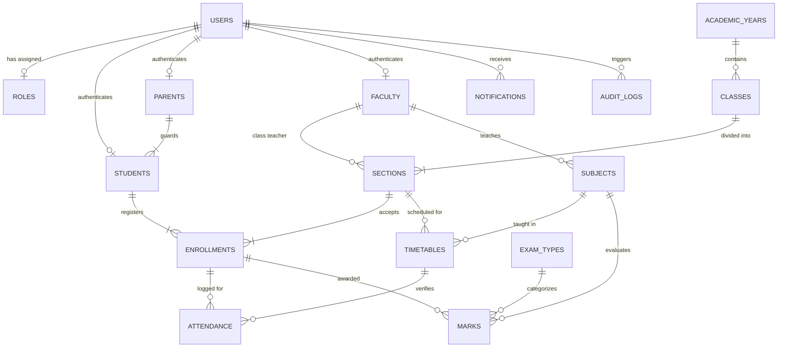

# Relational Database Schema Specification

> **Status**: Authoritative Design Specification  
> **Target Engine**: PostgreSQL 16+  
> **Implementation State**: PLANNED (Conceptual / Specification Phase - No migrations applied in Phase 1)  
> **Last Updated**: 2026-09-24

---

## 1. Schema Design Principles

1. **Normalization**: The schema adheres to Third Normal Form (3NF) to eliminate data redundancy and preserve referential integrity.
2. **Keying Strategy**:
   - Primary Keys: High-entropy UUID v4 or prefixed alphanumeric identifiers (e.g. `usr_`, `stu_`, `att_`) to avoid sequential enumeration attacks.
   - Surrogate keys are utilized for join performance, while natural unique keys (e.g., student admission numbers, employee codes, ISO period codes) are strictly indexed.
3. **Temporal Tracking**: Every transactional table inherits standard tracking fields: `created_at TIMESTAMP WITH TIME ZONE DEFAULT NOW()` and `updated_at TIMESTAMP WITH TIME ZONE DEFAULT NOW()`.
4. **Referential Integrity**: All relationships are backed by explicit Foreign Key constraints with deliberate `ON DELETE` semantics (`CASCADE`, `PROTECT`, or `SET NULL`).

---

## 2. Entity Relationship Overview

---

## 3. Major Entity Specifications

### 3.1 Identity & Access
- **`roles`**:
  - `id`: UUID (PK)
  - `name`: VARCHAR(32) UNIQUE (e.g. `'Admin'`, `'Principal'`, `'Faculty'`, `'Student'`, `'Parent'`)
  - `description`: TEXT
- **`users`**:
  - `id`: UUID / VARCHAR(36) (PK)
  - `role_id`: FK -> `roles.id` (RESTRICT)
  - `username`: VARCHAR(150) UNIQUE NOT NULL
  - `email`: VARCHAR(254) UNIQUE NOT NULL
  - `password_hash`: VARCHAR(255) NOT NULL
  - `first_name`: VARCHAR(150) NOT NULL
  - `last_name`: VARCHAR(150) NOT NULL
  - `phone`: VARCHAR(32)
  - `avatar_url`: TEXT
  - `is_active`: BOOLEAN DEFAULT TRUE
  - `created_at`, `updated_at`: TIMESTAMPTZ

### 3.2 Stakeholders & Profiles
- **`parents`**:
  - `id`: UUID / VARCHAR(36) (PK)
  - `user_id`: FK -> `users.id` (CASCADE, UNIQUE)
  - `relation`: VARCHAR(32) (e.g., `'Father'`, `'Mother'`, `'Legal Guardian'`)
  - `occupation`: VARCHAR(100)
  - `address`: TEXT
- **`students`**:
  - `id`: UUID / VARCHAR(36) (PK)
  - `user_id`: FK -> `users.id` (CASCADE, UNIQUE)
  - `parent_id`: FK -> `parents.id` (PROTECT, NULLABLE)
  - `admission_number`: VARCHAR(64) UNIQUE NOT NULL
  - `roll_number`: VARCHAR(64) NOT NULL
  - `date_of_birth`: DATE NOT NULL
  - `gender`: VARCHAR(16) NOT NULL
  - `blood_group`: VARCHAR(8)
  - `emergency_contact`: VARCHAR(32) NOT NULL
  - `address`: TEXT NOT NULL
  - `status`: VARCHAR(32) DEFAULT `'Active'`
- **`faculty`**:
  - `id`: UUID / VARCHAR(36) (PK)
  - `user_id`: FK -> `users.id` (CASCADE, UNIQUE)
  - `employee_code`: VARCHAR(64) UNIQUE NOT NULL
  - `department`: VARCHAR(100) NOT NULL
  - `designation`: VARCHAR(100) NOT NULL
  - `qualification`: VARCHAR(255)
  - `specialization`: TEXT
  - `office_room`: VARCHAR(64)
  - `joining_date`: DATE NOT NULL

### 3.3 Academics & Enrollment
- **`academic_years`**:
  - `id`: UUID (PK)
  - `name`: VARCHAR(32) UNIQUE (e.g., `'2025-2026'`)
  - `start_date`: DATE NOT NULL
  - `end_date`: DATE NOT NULL
  - `is_current`: BOOLEAN DEFAULT FALSE
- **`classes`**:
  - `id`: UUID (PK)
  - `academic_year_id`: FK -> `academic_years.id` (PROTECT)
  - `name`: VARCHAR(100) NOT NULL (e.g., `'Grade 11 - Computer Science'`)
  - `code`: VARCHAR(32) NOT NULL
- **`sections`**:
  - `id`: UUID (PK)
  - `class_id`: FK -> `classes.id` (CASCADE)
  - `name`: VARCHAR(32) NOT NULL (e.g., `'Section A'`)
  - `room`: VARCHAR(64)
  - `capacity`: INTEGER NOT NULL DEFAULT 35
  - `class_teacher_id`: FK -> `faculty.id` (SET NULL, NULLABLE)
  - Unique constraint on `(class_id, name)`
- **`subjects`**:
  - `id`: UUID (PK)
  - `name`: VARCHAR(150) NOT NULL
  - `code`: VARCHAR(32) UNIQUE NOT NULL
  - `department`: VARCHAR(100) NOT NULL
  - `credits`: INTEGER NOT NULL DEFAULT 3
  - `description`: TEXT
- **`enrollments`**:
  - `id`: UUID (PK)
  - `student_id`: FK -> `students.id` (CASCADE)
  - `section_id`: FK -> `sections.id` (CASCADE)
  - `academic_year_id`: FK -> `academic_years.id` (CASCADE)
  - `enrolled_date`: DATE DEFAULT CURRENT_DATE
  - `status`: VARCHAR(32) DEFAULT `'Enrolled'`
  - Unique constraint on `(student_id, academic_year_id)`

### 3.4 Operational & Academic Data
- **`timetables`**:
  - `id`: UUID (PK)
  - `section_id`: FK -> `sections.id` (CASCADE)
  - `subject_id`: FK -> `subjects.id` (PROTECT)
  - `faculty_id`: FK -> `faculty.id` (PROTECT)
  - `day_of_week`: VARCHAR(16) NOT NULL (e.g., `'Monday'`)
  - `period_number`: SMALLINT NOT NULL
  - `start_time`: TIME NOT NULL
  - `end_time`: TIME NOT NULL
  - `room_number`: VARCHAR(64)
  - Unique constraint on `(section_id, day_of_week, period_number)`
  - Unique constraint on `(faculty_id, day_of_week, period_number)` to prevent double booking
- **`attendance`**:
  - `id`: UUID (PK)
  - `enrollment_id`: FK -> `enrollments.id` (CASCADE)
  - `timetable_id`: FK -> `timetables.id` (SET NULL, NULLABLE)
  - `date`: DATE NOT NULL
  - `session_period`: SMALLINT
  - `status`: VARCHAR(16) NOT NULL CHECK (`status IN ('PRESENT', 'ABSENT', 'ON_DUTY', 'LEAVE')`) -- Canonical 4 statuses per Master Plan Amendment 2; LATE and EXCUSED strictly prohibited
  - `remarks`: TEXT
  - `recorded_by`: FK -> `users.id` (PROTECT)
  - `approved_by_faculty_id`: FK -> `faculty.id` (SET NULL, NULLABLE) -- Required when status is 'LEAVE'
  - Index on `(enrollment_id, date)`
- **`exam_types`**:
  - `id`: UUID (PK)
  - `name`: VARCHAR(64) UNIQUE NOT NULL (e.g., `'Midterm Exam'`, `'Final Exam'`, `'Quiz 1'`)
  - `weightage`: DECIMAL(5, 2) DEFAULT 100.00
- **`marks`**:
  - `id`: UUID (PK)
  - `enrollment_id`: FK -> `enrollments.id` (CASCADE)
  - `subject_id`: FK -> `subjects.id` (PROTECT)
  - `exam_type_id`: FK -> `exam_types.id` (PROTECT)
  - `marks_obtained`: DECIMAL(5, 2) NOT NULL
  - `max_marks`: DECIMAL(5, 2) NOT NULL DEFAULT 100.00
  - `grade`: VARCHAR(8) NOT NULL
  - `remarks`: TEXT
  - `evaluated_by`: FK -> `faculty.id` (SET NULL)
  - `evaluated_at`: TIMESTAMPTZ DEFAULT NOW()
  - Check constraint: `marks_obtained <= max_marks AND marks_obtained >= 0`

### 3.5 Governance, Communication & System Events
- **`calendar_events`**:
  - `id`: UUID (PK)
  - `title`: VARCHAR(200) NOT NULL
  - `category`: VARCHAR(64) NOT NULL (e.g., `'Exam'`, `'Holiday'`, `'Meeting'`, `'Academic'`)
  - `description`: TEXT
  - `start_date`: TIMESTAMPTZ NOT NULL
  - `end_date`: TIMESTAMPTZ NOT NULL
  - `target_roles`: JSONB NOT NULL DEFAULT `'[]'`
  - `location`: VARCHAR(255)
  - `is_holiday`: BOOLEAN DEFAULT FALSE
- **`allocations`**:
  - `id`: UUID (PK)
  - `academic_year_id`: FK -> `academic_years.id` (CASCADE)
  - `run_timestamp`: TIMESTAMPTZ DEFAULT NOW()
  - `parameters`: JSONB NOT NULL
  - `status`: VARCHAR(32) NOT NULL (e.g., `'Draft'`, `'Approved'`, `'Active'`)
- **`notifications`**:
  - `id`: UUID (PK)
  - `user_id`: FK -> `users.id` (CASCADE)
  - `title`: VARCHAR(200) NOT NULL
  - `message`: TEXT NOT NULL
  - `category`: VARCHAR(64) NOT NULL
  - `is_read`: BOOLEAN DEFAULT FALSE
  - `created_at`: TIMESTAMPTZ DEFAULT NOW()
- **`reports`**:
  - `id`: UUID (PK)
  - `report_type`: VARCHAR(100) NOT NULL
  - `generated_by`: FK -> `users.id` (SET NULL)
  - `generated_at`: TIMESTAMPTZ DEFAULT NOW()
  - `filter_criteria`: JSONB NOT NULL
  - `file_url`: TEXT
- **`audit_logs`**:
  - `id`: UUID (PK)
  - `user_id`: FK -> `users.id` (SET NULL, NULLABLE)
  - `action`: VARCHAR(64) NOT NULL (e.g., `'INSERT'`, `'UPDATE'`, `'DELETE'`, `'LOGIN'`)
  - `target_table`: VARCHAR(64) NOT NULL
  - `target_id`: VARCHAR(64) NOT NULL
  - `old_values`: JSONB
  - `new_values`: JSONB
  - `ip_address`: INET
  - `timestamp`: TIMESTAMPTZ DEFAULT NOW()
