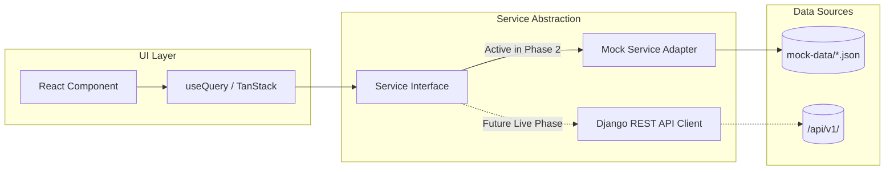

# Frontend Architecture Specification

> **Status**: Authoritative Frontend Specification  
> **Tech Stack**: React 18+, TypeScript, Vite, Tailwind CSS, shadcn/ui, React Router, TanStack Query, React Hook Form, Zod, Recharts, Lucide React  
> **Phase**: Phase 1 (Foundation & Governance)  
> **Last Updated**: 2026-09-23

---

## 1. Directory Structure & Modular Breakdown

The frontend codebase resides under `frontend/` and follows a strictly typed, modular domain pattern:

```text
frontend/
├── src/
│   ├── app/                # App entry, router definitions, global React context providers
│   ├── components/         # Reusable atomic UI elements (buttons, inputs, cards, dialogs)
│   ├── features/           # Domain-specific feature modules
│   │   ├── auth/           # Login, role selection, session restore
│   │   ├── students/       # Student directory, profile cards, enrollment views
│   │   ├── academics/      # Class rosters, subject lists, syllabus views
│   │   ├── attendance/     # Daily attendance tracker, monthly grids, status badges
│   │   ├── marks/          # Report cards, mark entry sheets, percentage/grade utilities
│   │   ├── timetable/      # Weekly grid scheduler, period blocks
│   │   ├── calendar/       # Event timeline, academic calendar, holiday highlights
│   │   ├── reports/        # Analytics dashboards, school report card exports
│   │   └── dashboard/      # Role-specific dashboard layouts and widgets
│   ├── layouts/            # Page frames: DashboardLayout (Sidebar+Topbar), AuthLayout, PublicLayout
│   ├── pages/              # Thin routing page containers mapping features to routes
│   ├── hooks/              # Global custom hooks (useAuth, useTheme, useMediaQuery, useDebounce)
│   ├── services/           # Service abstraction layer
│   │   ├── api/            # Future Axios / Fetch clients for Django /api/v1/
│   │   ├── mock/           # Mock data adapters consuming mock-data/*.json
│   │   └── index.ts        # Dynamic service switcher (Mock vs. Live API)
│   ├── lib/                # Utility configurations (cn() helper for shadcn, query client)
│   ├── types/              # Comprehensive TypeScript interfaces for all domain entities
│   └── utils/              # Pure helper functions: date-fns formatters, currency, number utilities
├── public/                 # Static assets, branding, favicons
├── tests/                  # Unit and integration test suites (Vitest + React Testing Library)
├── package.json
├── package-lock.json
├── vite.config.ts
├── tsconfig.json
└── tailwind.config.cjs
```

---

## 2. Service Abstraction & Data Fetching Philosophy

To ensure rapid frontend development without backend lock-in, the frontend employs the **Service Abstraction Pattern**:



### 2.1 The Two-Mode Service Switcher
- A global configuration flag (`VITE_USE_MOCK_DATA=true`) directs service factories to load from `services/mock/` or `services/api/`.
- Both implementations satisfy identical TypeScript interfaces (e.g., `AttendanceService`).
- When switching from mock data to the Django API, not a single component, layout, or page requires rewriting.

### 2.2 Server State Management (TanStack Query)
- All remote data fetching, caching, and cache invalidation is handled via `@tanstack/react-query`.
- Query keys are strongly typed and organized hierarchically: `['students', id]`, `['attendance', classId, date]`.
- Automatic background refetching and optimistic updates ensure real-time UI feel.

### 2.3 Contextual Prototype Data Separation
- Page and presentation components MUST NOT define local prototype datasets inline or import raw `.json` files directly.
- All domain records, timetable slots, examination rosters, attendance session logs, and report metadata are exposed via typed async methods on the service abstraction layer (`MockDataService`).
- Strict data flow: `Mock JSON / Service Data -> Mock Service -> Typed Data -> React Page / Component`.
- When transitioning to live Django REST APIs in future phases, pages require zero data structure refactoring.

---

## 3. Mock Authentication & Session Architecture (Phase 2)

### 3.1 Credential-Based Institutional Mock Authentication
In Phase 2, the frontend simulates institutional access via credential-based mock authentication (`MockAuthService.loginWithCredentials`):
- **User Inputs**: User ID / Institutional Email and Password.
- **Lookup**: Synthetic user records queried from `mock-data/users.json`.
- **Role Assignment**: Derived strictly from the matched synthetic mock record (`u.role`). The user does NOT select their role during normal login.
- **Session Persistence**: Serialized user session stored in client-side `localStorage` (`student_erp_active_user`).
- **Normal Demo UI Integrity**: 1-click role buttons and dashboard role-switcher dropdowns are removed from normal presentation flows. A logged-in student has no UI mechanism to assume administrative or faculty roles.
- **Status**: Authentication remains **MOCKED** for Phase 2. Real cryptographic JWT authentication with backend token issuance, rotation, and revocation remains **PLANNED** for Phase 4.

> [!WARNING]
> **Engineering Boundary Clarification**: Client-side route filtering and `localStorage` session state provide UX routing, NOT cryptographic security. Authoritative RBAC verification and object-level permission enforcement are strictly enforced at the backend REST API layer in future phases.

---

## 4. Routing & Role-Based Navigation Philosophy

1. **Declarative Routing**: Managed via `react-router-dom` (v6/v7).
2. **Role Gate Component**: 
   - A high-level `<RoleRoute allowedRoles={['Faculty', 'Admin']} />` verifies the active role from the auth context.
   - Unauthorized attempts automatically redirect to the user's role-appropriate home view.
3. **Lazy Loading**: Route pages are code-split using `React.lazy()` and wrapped in `<Suspense fallback={<LoadingSpinner />} />`.

---

## 5. UI Components & Design System

- **Styling Architecture**: Vanilla Tailwind CSS with custom HSL CSS variable design tokens.
- **Component Primitives**: Modeled after `shadcn/ui`, utilizing Radix UI accessible primitives and `clsx` + `tailwind-merge` (`cn()` utility).
- **Typography & Color Palette**: Slate/Zinc neutral dark/light theme tokens with Indigo/Violet primary accents and Emerald/Amber/Rose semantic states.
- **Iconography**: `lucide-react` for crisp, uniform SVG icons across all modules.

---

## 6. Forms, Validation & Data Integrity

- **Form State**: Managed using `react-hook-form` to minimize component re-renders.
- **Validation**: Schema-first client validation using `zod`.
- Every form (such as Student Enrollment, Attendance Entry, or Grade Submission) defines a Zod schema in `features/<domain>/schema.ts`, guaranteeing strict type safety between the DOM and service payload.

---

## 7. Data Visualization & Charting

- **Library**: `recharts` for composable, responsive SVG charts.
- **Implementations**:
  - Attendance trends (LineChart / AreaChart).
  - Subject mark distributions and grade averages (BarChart).
  - Class demographic breakdowns (PieChart / DonutChart).

---

## 8. Responsiveness & Accessibility (A11y)

1. **Mobile-First Responsive Grid**: Breakpoints follow Tailwind standards (`sm`, `md`, `lg`, `xl`, `2xl`).
2. **Accessible Primitives**: Keyboard navigability (`Tab`, `Esc`, arrow keys), ARIA labels on all icon-only buttons, and WCAG AA contrast compliance across all themes.

---

## 9. Indian School Academic & Operational Model

The frontend is strictly reconciled to the Indian senior secondary school model (CBSE / ICSE pattern, canonical identity "School ERP"):

### 9.1 Academic Evaluation System
- **Marks Out of 100**: All assessments accept numeric marks (0–100) or `'AB'` for absent candidates.
- **Cumulative Marks & Percentage**: Displayed as aggregate marks obtained over maximum marks (e.g. 435 / 500) and overall percentage rounded to 2 decimal places (87.00%).
- **Standard 8-Tier Letter Grade Scale**: Centralized in `src/utils/grading.ts`:
  - `A1`: 91–100% (Outstanding)
  - `A2`: 81–<91% (Very Good)
  - `B1`: 71–<81% (Good)
  - `B2`: 61–<71% (Above Average)
  - `C1`: 51–<61% (Average)
  - `C2`: 41–<51% (Fair)
  - `D`: 33–<41% (Passing)
  - `E`: <33% (Needs Improvement / Essential Repeat)
- **Zero University Traces**: University GPA, CGPA, credits, credit hours, and degree terminology are completely purged.

### 9.2 Indian School Hierarchy & Senior Streams
- **Class Structure**: Academic Year → Grade/Class → Stream (Grades 11–12) → Section → Students.
- **Grades below 11**: General secondary core curriculum (Sections A and B).
- **Grades 11–12**: Exactly 4 approved streams with stream-specific sections:
  1. *Computer Science A* (Sections A1, A2, A3)
  2. *Bio-Maths B* (Sections B1, B2, B3)
  3. *Commerce C* (Sections C1, C2, C3)
  4. *Pure Science D* (Sections D1, D2, D3)

### 9.3 Four-Status Attendance Model (Master Plan Amendment 2)
- Canonical statuses: `PRESENT`, `ABSENT`, `ON_DUTY`, `LEAVE`.
- Formula: $\text{Attendance \%} = \frac{\text{PRESENT} + \text{ON\_DUTY}}{\text{PRESENT} + \text{ABSENT} + \text{ON\_DUTY} + \text{LEAVE}} \times 100$.
- `LEAVE` is faculty-approved and counts as an absence in attendance percentage calculations.

### 9.4 Non-Evaluative Faculty Architecture
- Faculty information is strictly descriptive: Name, Designation, Department, Assigned Classes, Workload in periods/week, and Timetable.
- Zero faculty performance ratings, review scores, or teacher leaderboards.

### 9.5 Enterprise School Design Standards
- Palette: Deep navy primary (`bg-blue-900`), clean white/slate surfaces, flat bordered panels, minimal shadows.
- Global Header shows School Name, Academic Year (`2026–27`), User Name, and Role.
- All glowing/neon/sci-fi effects, 3D blobs, and AI sparkle icons are prohibited.
